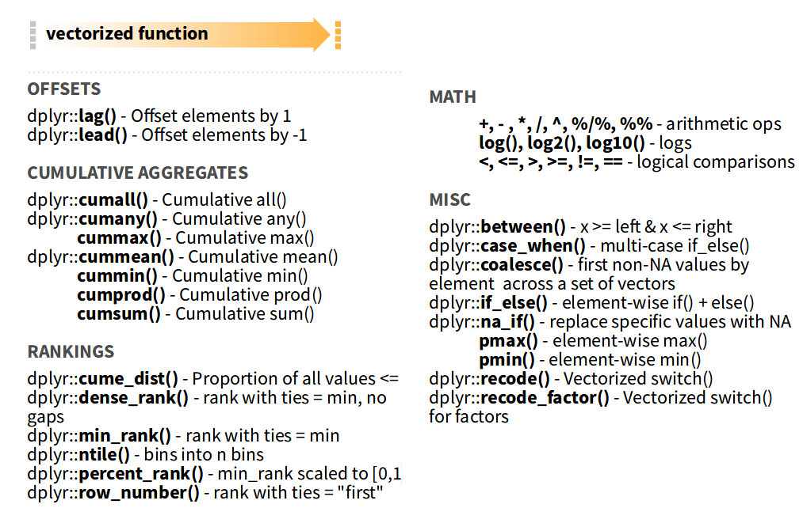
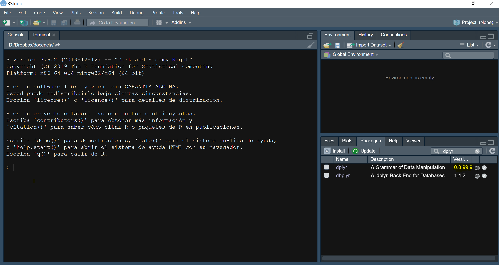

```{r setup, include=FALSE}
library(tidyverse)
library(forcats)
library(lubridate)
knitr::opts_chunk$set(echo = TRUE, message = FALSE, warning = FALSE, collapse = TRUE)
```

## Introducción

- Implementa una gramática para realizar operaciones básicas con data frames

- Muy eficiente

- Operaciones principales: `slice`, `filter`, `select`, `arrange`, `mutate` y `summarize`

- Estas operaciones se pueden componer para realizar otras más complejas

---

## slice

Selecciona filas por su posición
```{r, echo = TRUE}
slice(mpg, 1:5)
```

---

## filter

Selecciona filas por condición
```{r, echo=T}
filter(mpg, model == "a4")
```

---

## Operadores lógicos

- R implementa todos los operadores relacionales habituales `>, <, >=, <=, ==, !=`

- Los operadores lógicos son la negación `!`, and `&` y or `|`

- El resultado de todas estas operaciones son valores lógicos `TRUE` (`T`) o `FALSE` (`F`)

---

## filter (cont.)

- Se pueden combinar multiples condiciones separadas por `,` (and lógico)
    ```{r, echo=T, eval=F}
    filter(mpg, model == "a4", cyl >= 5)
    ```

- También se puede usar explicitamente el operador
    ```{r, echo=T, eval=F}
    filter(mpg, model == "a4" & cyl >= 5)
    ```

- En el caso del or lógico es obligatorio el uso del operador
    ```{r, echo=T, eval=F}
    filter(mpg, model == "a4" | model == "mustang")
    ```

---

## Variantes de slice

- [Referencia](https://dplyr.tidyverse.org/reference/slice.html)

- Seleccionar las 5 primeras filas
    ```{r}
    slice_head(mpg, n = 5)
    ```
    
- Seleccionar el top n de acuerdo al valor de una columna
    ```{r}
    slice_max(mpg, hwy, n = 1)
    ```


---

## select

Seleccionar variables (columnas) de un data frame
```{r, echo=T}
select(mpg, model, displ, cyl)
```

---

## Ignorar variables

Con un `-` se ignoran variables
```{r, echo=T}
select(mpg, -manufacturer)
```

---

## Rangos

Puesto que las variables están ordenadas, se puede seleccionar un rango con `:`

```{r, echo=T}
select(mpg, model:trans)
```

---

## Predicados lógicos en select

- A partir de la versión 1.0 de dplyr, [`select`](https://dplyr.tidyverse.org/dev/reference/select.html) también acepta predicados lógicos
    ```{r}
    select(mpg, is.numeric)
    ```

---

## Funciones auxiliares

Las siguientes funciones se pueden usar dentro de `select()`

- `starts_with()`: empiezan con un prefijo
- `ends_with()`: terminan con un sufijo
- `contains()`: contienen una string
- `matches()`: concuerdan con una expresión regular
- `num_range()`: rango numérico como "X01", "X02", "X03"
- `any_of`, selecciona las variables contenidas en un vector de cadenas
- `all_of`, igual que la anterior pero da un error si no están todas las variables

```{r}
vars <- c("cyl", "cty", "mpg")
select(mpg, any_of(vars)) %>%
  head(5)
```


```{r, error=TRUE}
select(mpg, all_of(vars))
```

---

## Combinar múltiples selecciones

* Se pueden utilizar los operadores `&`, `|` y `!` para combinar múltiples selecciones:
    ```{r}
    # Variables numéricas excepto cyl y year
    select(mpg, is.numeric & !c(cyl, year)) %>%
      head(5)
    ```
    ```{r}
    # Contienen "y" o empiezan por "f"
    select(mpg, contains("y") | starts_with("f")) %>%
      head(5)
    ```

---

## arrange

Ordena las filas de un data frame
```{r, echo=T}
arrange(mpg, desc(year), cyl)
```

---

## mutate

Añade nuevas variables (columnas) al data frame como combinación de las ya existentes
```{r, echo=T}
mutate(mpg, avg_mpg = (cty+hwy)/2)
```

---

## Operadores y funciones aritméticas

- R implementa los operadores aritméticos habituales 
    + suma `+`
    + resta `-`
    + multiplicación `*`
    + división `/`
    + exponenciación `^`
    + división entera `%/%`
    + módulo (resto) `%%`

- También las funciones aritméticas comunes: `log()`, `exp()`, `sin()`, `cos()`, `tan()`, `cumsum()`, `cumprod()`, `abs()`, `sqrt()`, `round()`, `ceiling()`, `floor()`, `trunc()`, ...

- Operan sobre vectores (columnas de un data frame) elemento a elemento

---

## Funciones vectoriales

.center[

]

---

## summarize

- Reduce (resume) los valores de una columna en un único valor.

- Se pueden realizar múltiples operaciones separadas por ','
    ```{r, echo=T}
    summarize(mpg, max_cyl = max(cyl), avg_cty = mean(cty), min_year = min(year))
    ```

- Algunas de las funciones de agregacion pueden operar sobre varias columnas
    ```{r}
    summarize(mpg, pares_distintos = n_distinct(cyl, cty), maxim = max(cyl, cty))
    ```

- El resultado es siempre un dataframe

---

## Funciones de agregación

- Las funciones más comunes para usar dentro de `summarize()` son: 
    + Aritméticas: `prod()`, `sum()`
    + Centralidad: `mean()`, `median()`
    + Dispersión: `sd()`, `var()`, `mad()`
    + Rango: `max()`, `min()`, `quantile()`
    + Posición: `first()`, `last()`, `nth()`
    + Lógicas: `any()`, `all()`
    + *Conteo*: `n()`, `n_distinct()`
      - Solo se pueden usar dentro de `summarize()`
      - `n()` no recibe argumentos, `n_distinct()` el nombre de la(s) columna(s).
    
- Todas reducen un vector de números a un único resultado.

.center[

]

---

## Comprobar versión paquetes

.center[


]

---

## Funciones que devuelven múltiples valores

- Desde la versión 1.0 de dplyr, `summarize` acepta funciones que devuelven más de un valor
    ```{r}
    summarize(mpg, rango = range(cty), cuant = quantile(displ, c(0.25, 0.75)))
    ```

- Se crean tantas filas como valores devuelven las operaciones y tantas columnas como operaciones

- No confundir con las funciones vectoriales que se usan principalmente dentro de `mutate`

---

## Errores comunes

- Se pueden mezclar funciones que devuelven un valor con funciones que devuelven varios
    ```{r}     
    summarize(mpg, min = min(cyl), qs = quantile(displ, c(0.25, 0.5, 0.75)))
    ```
    
- Ojo con mezclar funciones que devuelven distinto número de valores (aparte de 1)
    ```{r, error=TRUE}
    summarize(mpg, rango = range(cyl), qs = quantile(displ, c(0.25, 0.5, 0.75)))
    ```

---

## Concatenación de funciones

- Todas las funciónes de `dplyr` toman como primer argumento un data frame y devuelven otro data frame

- Se pueden aplicar de manera consecutiva:
    ```{r, echo=T, eval=F}
    arrange(select(filter(mpg, model == "a4"), model, year), year)
    
    arrange(
      select(
        filter(mpg, model == "a4"), 
        model, year
      ), 
      year
    )
    ```

---

## Concatenación de funciones (cont.)

- Otra opción:
    ```{r, echo=T, eval=F}
    df1 <- filter(mpg, model == "a4")
    df2 <- select(df1, model, year)
    df3 <- arrange(df2, year)
    ```

- Habitualmente no nos interesan los valores intermedios, solo el resultado final

---

## Operador "tubería" (*pipe*)

- La sintaxis es `%>%`

- El codigo `df %>% foo()` es equivalente a `foo(df)`

- Esto permite concatenar funciones sin almacenar resultados intermedios y siguiendo el orden lógico

- Comparación:

.pull-left[
```{r, eval=FALSE}
# Opción 1
arrange(
  select(
    filter(mpg, model == "a4"), 
    model, year
  ), 
  year
)

# Opción 2
df1 <- filter(mpg, model == "a4")
df2 <- select(df1, model, year)
df3 <- arrange(df2, year)
```
]
.pull-right[
    ```{r, echo=T, eval=F}
    # Operador tuberia
    mpg %>%
      filter(model == "a4") %>%
      select(model, year) %>%
      arrange(year)
    ```
]
