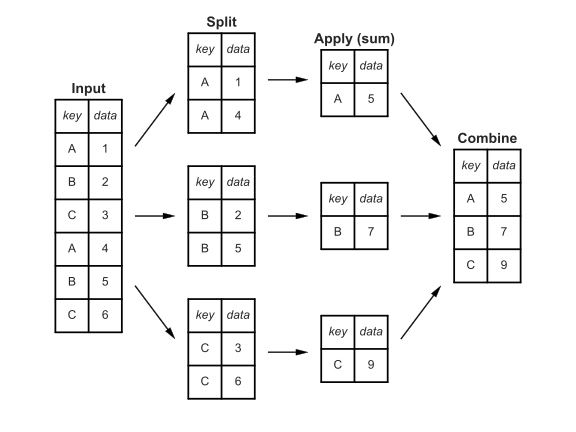

```{r setup, include=FALSE}
library(tidyverse)
knitr::opts_chunk$set(echo = TRUE, message = FALSE, warning = FALSE, collapse = TRUE, fig.align='center')
```

## Operaciones agrupadas

- La función `group_by()` convierte un data frame en otro agrupado por una o más variables

- En los data frames agrupados todas las operaciones anteriores se realizan "por grupo"

- `ungroup()` elimina la agrupación.

---

## Slice con group_by

- Los indices son relativos al grupo.
```{r,eval=T}
mpg %>%
  group_by(cyl) %>%
  slice(1:2)
```

---

## Select con group_by

- `select()` mantiene siempre las variables agrupadas, aunque no se indique explicitamente.
```{r, warning=TRUE, message=TRUE}
data <- mpg %>%
  group_by(cyl) %>%
  select(cty)

glimpse(data)
```

---

## arrange con group_by

- `arrange()` ignora la agrupación, a no ser que el parámetro `.by_group` sea `TRUE`

.pull-left[
```{r}
mpg %>%
  select(year, cty) %>%
  group_by(year) %>%
  arrange(cty)
```
]

.pull-right[
```{r}
mpg %>%
  select(year, cty) %>%
  group_by(year) %>%
  arrange(cty, .by_group = TRUE)
```
]

---

## mutate con group_by

Un `mutate()` sobre un data frame agrupado devuelve siempre otro data frame con el mismo número de filas que el original.

.pull-left[
```{r, echo=T}
mpg %>%
  # sin group_by
  mutate(avg_cty = mean(cty)) %>%
  # ungroup no necesario
  select(cyl, cty, avg_cty)

```
]

.pull-right[
```{r, echo=T}
mpg %>%
  group_by(cyl) %>%
  mutate(avg_cty = mean(cty)) %>%
  ungroup() %>%
  select(cyl, cty, avg_cty)

```
]

---

## Metodología split-apply-combine

.center[


.footnotesize[[Jake VanderPlas. Group-by From Scratch](https://jakevdp.github.io/blog/2017/03/22/group-by-from-scratch/)]
]

---

## group_by + summarize

- La metodología anterior se implementa con `group_by + summarize`
    ```{r, echo=T}
    mpg %>%
       group_by(cyl) %>%
       summarize(avg_cty = mean(cty))
    ```

- Devuelve un dataframe con tantas filas como grupos (valores distintos de la/s variable/s usadas para agrupar).


---

## Agrupar por múltiples columnas

- Podemos agrupar por múltiples columnas
    ```{r, highlight.output = 2 }
    mpg %>%
      group_by(drv, year) %>%
      summarize(avg_hwy = mean(hwy))
    ```
 
- `summarize` elimina un nivel de la agrupación (empezando por la derecha), por lo que hay que tener cuidado si realizamos operaciones posteriores sobre el resultado

---

## Número de grupos

- El número de grupos es el número de combinaciones posibles de los valores distintos
    ```{r}
    mpg %>%
      summarize(n_year = n_distinct(year), 
                n_trans = n_distinct(drv),
                n_comb = n_distinct(year, drv))

    ```

---


## joins

- La librería `dplyr` implementa funciones para unir data frames: 
  + `inner_join(x,y)`: Devuelve las filas que crucen tant en x como en y.
  + `left_join(x,y)`: Devuelve todas, las filas en x y las que crucen en y (completa con NA)
  + `right_join(x,y)`: Devuelve todas las filas en y y las que crucen en x (completa con NA).
  + `full_join(x,y)`: Devuelve todas las filas de x e y (completa con NA).
  + `semi_join(x,y)`: Devuelve solo las filas de x que crucen con y (pero no y).
  + `anti_join(x,y)`: Devuelve solo las filas de x que NO crucen con y.

- Diagrama de Venn. [R for Data Science. Relational data](https://r4ds.had.co.nz/relational-data.html)

.center[

]


---

## Equivalencia con SQL

| dplyr                       | SQL                                            | 
|-----------------------------|------------------------------------------------|
|`inner_join(x, y, by = "z")`	| `SELECT * FROM x INNER JOIN y USING (z)`       |
|`left_join(x, y, by = "z")`	| `SELECT * FROM x LEFT OUTER JOIN y USING (z)`  |
|`right_join(x, y, by = "z")` |	`SELECT * FROM x RIGHT OUTER JOIN y USING (z)` |
|`full_join(x, y, by = "z")`  |	`SELECT * FROM x FULL OUTER JOIN y USING (z)`  |

.center[
Fuente: [R for Data Science. Relational data](https://r4ds.had.co.nz/relational-data.html)
]

---

## Ejemplo (I)

- **t4a**: Número de casos de tuberculosis en Afganistán, Brasil y China durante los años 1999 y 2000

- **t4b**: Población de Afganistán, Brasil y China durante los años 1999 y 2000

```{r include=FALSE}
t4a <- gather(table4a, key = "year", 
              value = "cases", num_range("", 1999:2000))
t4b <- gather(table4b, key = "YEAR", 
              value = "population", `1999`:`2000`)
```

.col-left[
```{r}
t4a

t4b
```
]

.col-right[
```{r}
join <- inner_join(t4a, t4b, 
                   by=c("year" = "YEAR", "country"))
join
```
]
---

## Ejemplo (II)

```{r, echo=TRUE}
x <- tibble(x1=c("A","B","C"),x2=1:3)
x
y <- tibble(x1=c("B","C","D"),x3=2:4)
y
left_join(x,y,by=c("x1"))
```

---

## Ejemplo (III)

```{r, echo=TRUE}
right_join(x,y,by=c("x1"))
full_join(x,y,by=c("x1"))
semi_join(x,y,by=c("x1"))
anti_join(x,y,by=c("x1"))
```

---

## Operaciones sobre múltiples columnas

- Una misma operación sobre múltiples columnas
    ```{r}
    summarize(mpg, 
              avg_hwy = mean(hwy), 
              avg_cty = mean(cty), 
              avg_displ = mean(displ))
    ```
    
- Se puede reescribir de forma más compacta usando la función `across` (dplyr >= 1.0)
    ```{r}
    summarize(mpg, across(c(hwy, cty, displ), mean))
    ```

- Más información: [Column-wise operations](https://dplyr.tidyverse.org/dev/articles/colwise.html)


---

## Función across

- Recibe dos argumentos:

   1. Selección de columnas (nombre, posición o tipo, al igual que [`select`](https://dplyr.tidyverse.org/dev/reference/dplyr_tidy_select.html))

   2. Lista de funciones a aplicar sobre las columnas
   
```{r}
summarize(mpg, across(is.numeric, mean)) 
```
    
```{r}
summarize(mpg, across(is.character, n_distinct))
```

```{r}
summarize(mpg, across(c(year, cyl), range))
```

---

## Múltiples funciones

- `across` acepta varias funciones mediante una lista
    ```{r}
    summarize(mpg, across(c(year, cyl), list(min, max))) 
    ```

- Es recomendable nombrar los elementos de la lista, para que las columnas de salida tengan el nombre `"columna_función"`
    ```{r}
    summarize(mpg, across(is.numeric, list(media = mean, desv = sd)))
    ```

---

- El formato anterior se puede cambiar modificando el parámetro opcional `.names`
    ```{r}
    summarize(mpg, across(c(year, cyl), list(menor = min, mayor = max),
                          .names = "{fn}-{col}"))
    ```
    
---

## Group_by + across

- `across` no aplica sobre las variables que se usan para agrupar
    ```{r}
    iris %>%
      group_by(Species) %>%
      summarize(across(is.numeric, mean))
    ```

---

## Errores comunes

- `summarize` realiza las operaciones de izquierda a derecha, hay que tener cuidado cuando se combina `across` con otras operaciones:
    ```{r}
    iris %>%
      group_by(Species) %>%
      summarize(n = n(), across(is.numeric, sd))
    ```
    ```{r}
    iris %>%
      group_by(Species) %>%
      summarize(across(is.numeric, sd), n = n())
    ```
    
    
---

## Otras funciones de dplyr + across

`across` se puede usar también en otras funciones. Ejemplos: 

 * Seleccionar filas donde las columnas Ozone **y** Solar.R son `NA`
      ```{r}
      filter(airquality, across(c(Ozone, Solar.R), is.na))
      ```
      ```{r}
      # version sin across, equivalente
      filter(airquality, is.na(Ozone), is.na(Solar.R))
      ```
---
 
 * Calcular el logaritmo de todas las columnas numéricas
      ```{r}
      iris %>% 
        mutate(across(is.numeric, log)) %>%
        head()
      ```

---

## Operaciones de conjuntos

- `dplyr` implementa la lógica de operaciones con conjuntos sobre tibbles
  + `intersect(x,y)`: Filas que aparecen tanto en x como en y
  + `union(x,y)`: Filas que aparecen en x, en y, o en ambos
  + `setdiff(x,y)`: Filas que aparecen en x, pero no en y
  
```{r,eval=F}
x <- tibble(
  x1=c("A","B","C"),
  x2=1:3
)
y <- tibble(
  x1=c("B","C","D"),
  x2=2:4
)
dplyr::intersect(x,y)
dplyr::union(x,y)
dplyr::setdiff(x,y)
```


---

## Añadir filas

- `dplyr` implementa las funciones `bind_rows` y `bind_cols` para añadir filas o columnas a un tibble, respectivamente

- En `bind_rows` las columnas se combinan por nombre y las columnas que no están en alguno de los dataframes se rellenan con NAs

```{r, eval=T}
bind_rows(
  c(a = 1, b = 2),
  tibble(saludo="hola", a = 3:4, b = 5:6),
  c(a = 7, b = 8)
)
```

---

## Añadir columnas

- En `bind_cols` se unen las subtablas por posición -> todos los dataframes deben tener el mismo número de filas
  + Para unir por valores, usar `join`.

```{r,eval=T}
  
# Both have to be tibbles
bind_cols(
  tibble(a = 3:4, b = c("a", "b")),
  tibble(logical = c(T, F))
)
```
